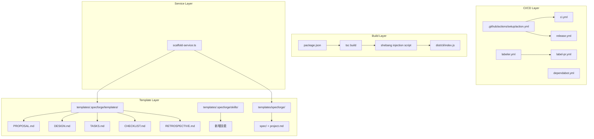

# Design Document: CI/CD and Templates Optimization

## Overview

本设计文档描述 SpecForge 项目在 CI/CD 流程完善和 templates/ 目录优化两个方面的技术方案。涵盖四个核心领域：

1. **CI/CD 架构重构** — 消除重复 setup、替换弃用 Action、添加 Dependabot 和 PR 自动标签
2. **构建系统修复** — 修复 npm 发布时的 bin 入口问题（shebang 注入、package.json 调整）
3. **模板体系完善** — 产物模板、技能扩展、用户资产目录补全
4. **Init 命令集成** — scaffold-service.ts 对新模板的处理确认

## Architecture

### 整体架构不变

本次优化不改变 SpecForge 的核心架构（分层架构、双目录模型、懒加载命令）。变更集中在：

- **CI/CD 层**：GitHub Actions 配置文件（`.github/` 目录）
- **构建层**：`package.json` 配置 + 构建脚本
- **模板层**：`templates/` 目录下的静态资产
- **服务层**：`scaffold-service.ts` 的微调（如有必要）



## Components and Interfaces

### 1. Composite Action: `.github/actions/setup/action.yml`

封装所有 CI job 共用的环境配置步骤为单一可复用组件。

**接口定义：**

```yaml
# .github/actions/setup/action.yml
name: 'Setup Environment'
description: 'Setup Node.js, pnpm, cache, and install dependencies'
inputs:
  node-version:
    description: 'Node.js version'
    required: false
    default: '24.14.1'
  pnpm-version:
    description: 'pnpm version'
    required: false
    default: '9'
runs:
  using: 'composite'
  steps:
    - uses: actions/checkout@v4
    - uses: actions/setup-node@v4
    - uses: pnpm/action-setup@v2
    - cache setup
    - pnpm install --frozen-lockfile
```

**消费方式：** 各 CI job 通过 `uses: ./.github/actions/setup` 引用。

### 2. Release Workflow 改进

替换 `actions/create-release@v1` 为 `softprops/action-gh-release@v2`。

**变更点：**
- 使用 `softprops/action-gh-release@v2` 创建 GitHub Release
- 自动生成 release notes（`generate_release_notes: true`）
- 添加 bin 入口验证步骤（build 后、publish 前）

### 3. 构建系统 Shebang 注入

**方案：** 在 `package.json` 的 `build` 脚本中，tsc 编译后追加 shebang 注入步骤。

```json
{
  "scripts": {
    "build": "tsc -p tsconfig.json && node scripts/inject-shebang.mjs"
  }
}
```

**`scripts/inject-shebang.mjs`** 职责：
- 读取 `dist/cli/index.js`
- 在文件头部插入 `#!/usr/bin/env node\n`（如果尚未存在）
- 写回文件

### 4. Template Renderer 兼容性

现有 `template-renderer.ts` 已支持 `{{variableName}}` 占位符替换，无需修改。`scaffold-service.ts` 的 `copyDirWithRendering` 已递归处理 `.md`、`.yaml`、`.json` 文件的变量渲染。

### 5. PR 自动标签系统

**组件：**
- `.github/labeler.yml` — 路径到标签的映射规则
- `.github/workflows/label-pr.yml` — 触发 `actions/labeler@v5` 的工作流

## Data Models

### 产物模板文件结构

每个产物模板遵循统一的 frontmatter + 章节结构：

```yaml
---
name: "{{artifactName}}"
type: "<proposal|design|tasks|checklist|retrospective>"
phase: "<requirements|design|planning|implementation|evolution>"
version: "{{version}}"
createdAt: "{{createdAt}}"
---
```

### 技能文件结构

```yaml
---
name: "<skill-name>"
description: "<触发场景描述>"
version: "0.1.0"
author: "specforge"
---
```

### Dependabot 配置结构

```yaml
version: 2
updates:
  - package-ecosystem: "npm"
    directory: "/"
    schedule:
      interval: "weekly"
    open-pull-requests-limit: 5
    labels: ["dependencies"]
  - package-ecosystem: "github-actions"
    directory: "/"
    schedule:
      interval: "weekly"
    open-pull-requests-limit: 5
    labels: ["dependencies"]
```

### Labeler 配置结构

```yaml
ci:
  - changed-files:
      - any-glob-to-any-file: '.github/**'
templates:
  - changed-files:
      - any-glob-to-any-file: 'templates/**'
cli:
  - changed-files:
      - any-glob-to-any-file: 'src/**'
docs:
  - changed-files:
      - any-glob-to-any-file: '**/*.md'
```

### Package.json 变更

```json
{
  "bin": {
    "specforge": "./dist/cli/index.js"
  },
  "files": [
    "dist",
    "templates",
    "!dist/**/*.test.js",
    "!dist/**/__tests__",
    "!dist/**/*.map"
  ],
  "scripts": {
    "dev": "tsx src/cli/index.ts",
    "build": "tsc -p tsconfig.json && node scripts/inject-shebang.mjs",
    "build:check-bin": "node scripts/verify-bin.mjs"
  }
}
```

### 目录结构变更总览

```
新增文件/目录：
├── .github/
│   ├── actions/setup/action.yml          # Composite Action
│   ├── dependabot.yml                     # Dependabot 配置
│   ├── labeler.yml                        # PR 标签规则
│   └── workflows/label-pr.yml            # 标签工作流
├── scripts/
│   ├── inject-shebang.mjs                 # Shebang 注入脚本
│   └── verify-bin.mjs                     # Bin 入口验证脚本
├── templates/
│   ├── .specforge/
│   │   ├── templates/
│   │   │   ├── PROPOSAL.md               # 需求提案模板
│   │   │   ├── DESIGN.md                 # 设计文档模板
│   │   │   ├── TASKS.md                  # 任务列表模板
│   │   │   ├── CHECKLIST.md              # 检查清单模板
│   │   │   └── RETROSPECTIVE.md          # 复盘模板
│   │   └── skills/
│   │       ├── architecture/
│   │       │   ├── event-driven-design/SKILL.md
│   │       │   └── layered-architecture/SKILL.md
│   │       ├── testing/
│   │       │   ├── tdd-workflow/SKILL.md
│   │       │   └── integration-test-strategy/SKILL.md
│   │       ├── security/
│   │       │   └── auth-patterns/SKILL.md
│   │       └── workflow-steps/language-adapters/references/
│   │           ├── node.md
│   │           ├── python.md (已存在 python-conventions.md)
│   │           └── go.md
│   └── specforge/
│       ├── spec/.gitkeep                  # 规格目录
│       └── project.md                     # 项目元数据模板

修改文件：
├── .github/workflows/ci.yml              # 引用 Composite Action
├── .github/workflows/release.yml         # 替换弃用 Action + 添加验证
└── package.json                           # bin/files/scripts 修改
```


## Error Handling

### CI/CD 错误处理

| 场景 | 处理方式 |
|------|----------|
| Composite Action 中 pnpm install 失败 | 步骤失败，job 终止，GitHub Actions 报告错误 |
| Release 版本号不匹配 | 验证步骤失败，终止发布，输出版本差异信息 |
| bin 入口验证失败（文件不存在/无 shebang/启动失败） | 终止发布流程，输出具体验证失败原因 |
| GitHub Release 创建失败 | 输出错误信息，npm 发布结果保留（已成功的不回滚） |
| Labeler 无法匹配路径 | 静默跳过，不添加标签，不阻塞 PR |

### 构建系统错误处理

| 场景 | 处理方式 |
|------|----------|
| `inject-shebang.mjs` 找不到 `dist/cli/index.js` | 脚本以非零退出码终止，build 命令失败 |
| shebang 已存在 | 跳过注入，幂等操作 |
| `verify-bin.mjs` 验证失败 | 输出具体失败原因（缺文件/缺 shebang/启动错误），非零退出 |

### Init 命令错误处理

现有 `scaffold-service.ts` 的错误处理已覆盖：
- 目标目录已存在时的覆盖确认（由 `init.ts` 命令层处理）
- 文件读写失败时的 fs-extra 异常传播
- 模板变量未定义时保留原始占位符（`template-renderer.ts` 的现有行为）

## Testing Strategy

### 为什么不使用 Property-Based Testing

本特性的变更主要集中在以下领域，均不适合 PBT：

1. **CI/CD 工作流配置**（GitHub Actions YAML）— 属于基础设施配置，非函数式逻辑
2. **Package.json 配置变更** — 声明式配置，无输入/输出变化
3. **静态模板文件**（Markdown）— 内容固定，无运行时行为
4. **Shebang 注入脚本** — 逻辑极其简单（检查+前置），用 example-based 测试即可覆盖
5. **Dependabot/Labeler 配置** — 声明式 YAML，由 GitHub 平台解释执行

因此本特性**省略 Correctness Properties 章节**，采用 example-based 单元测试 + 集成测试策略。

### 单元测试

| 测试目标 | 测试内容 | 框架 |
|----------|----------|------|
| `scripts/inject-shebang.mjs` | 1. 正常注入 shebang<br>2. 已有 shebang 时幂等<br>3. 目标文件不存在时报错 | Vitest |
| `scripts/verify-bin.mjs` | 1. 文件存在且有 shebang 时通过<br>2. 文件不存在时失败<br>3. 缺少 shebang 时失败<br>4. CLI 启动失败时报错 | Vitest |
| `scaffold-service.ts` | 验证新增的 `spec/` 目录和 `project.md` 被正确复制 | Vitest |
| 产物模板文件 | 验证每个模板包含必需的 frontmatter 字段和章节 | Vitest |

### 集成测试

| 测试目标 | 测试内容 |
|----------|----------|
| `pnpm build` 完整流程 | 验证 build 后 `dist/cli/index.js` 存在且包含 shebang |
| `specforge init` E2E | 验证初始化后目标目录包含所有新增模板文件 |
| CLI 启动验证 | `node dist/cli/index.js --help` 正常输出 |

### CI/CD 验证

CI/CD 配置的正确性通过以下方式验证：
- **语法验证**：GitHub Actions 在 push 时自动校验 YAML 语法
- **功能验证**：PR 提交后观察 CI 流水线是否正常运行
- **手动验证**：Release 流程通过创建测试 tag 验证

### 测试命令

```bash
pnpm test                    # 运行所有单元测试
pnpm build                   # 验证构建流程（含 shebang 注入）
pnpm build:check-bin         # 独立验证 bin 入口
```
