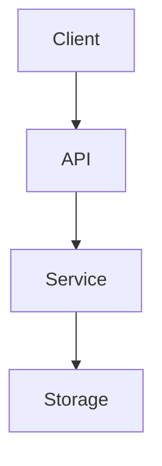
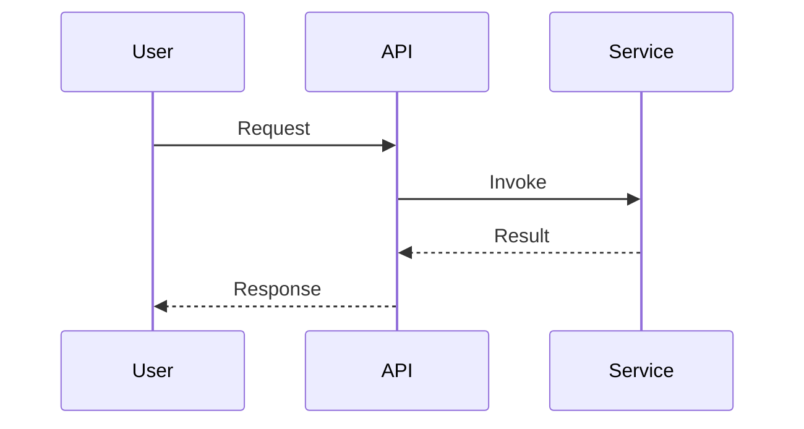
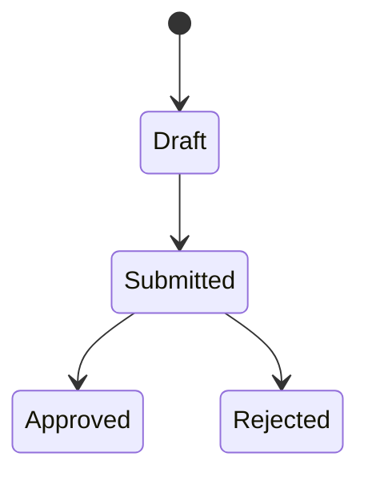

# 设计文档：{{featureName}}

> 本模板对应 `rules.design.artifacts.design.requiredSections`。没有接口契约与错误策略，禁止进入 planning/implementation（见 E003_contractMissing）。

## 架构概览（Architecture Overview）

### 模块职责

简要说明本次设计涉及的模块及其职责边界。

- **模块 A**：职责说明。
- **模块 B**：职责说明。

### 架构图

建议使用 Mermaid 绘制组件关系：

### 设计权衡

列出 2-3 个关键设计决策及其权衡（可参考 ADR 风格）。

## 接口契约（Interface Contracts）

每个对外接口必须明确：输入、输出、前置条件、后置条件、不变量、错误响应。

### 接口 1：{{接口名}}

| 字段        | 类型 | 必填 | 说明 |
| ----------- | ---- | ---- | ---- |
| 入参字段 1  |      |      |      |
| 出参字段 1  |      |      |      |

- **前置条件**：
- **后置条件**：
- **幂等性**：是 / 否
- **超时 / 重试**：

### 接口 N：…

## 错误分类与错误码策略（Error Taxonomy）

### 错误分类

- **用户错误**（4xx 类）：参数校验失败、权限不足。
- **系统错误**（5xx 类）：依赖故障、超时、内部异常。
- **业务错误**：领域规则违反。

### 错误码约定

| 错误码 | 分类 | 触发条件 | 用户可见文案 | 重试建议 |
| ------ | ---- | -------- | ------------ | -------- |
| E1001  |      |          |              |          |

### 错误传播策略

- 说明错误在层与层之间如何转换（例如 Service 抛出领域错误，API 层映射为 HTTP 状态码）。
- 说明日志、告警、用户提示的分级策略。

## 数据流 / 状态机（Data Flow & State Machine）

### 数据流

### 状态机（如适用）

## 测试策略（Testing Strategy）

### 分层策略

- **单元测试**：目标覆盖率、重点覆盖的纯函数 / 核心算法。
- **集成测试**：跨模块 / 跨进程场景，含外部依赖的契约测试。
- **端到端测试**：覆盖的主要用户故事。

### 属性测试（如适用）

若本次变更存在复杂状态、输入空间大、等价关系可刻画，列出计划的 Correctness Properties。
若因领域原因（纯配置、静态内容）不适用 PBT，请在此显式说明原因。

### 回归与验证

- 回归测试集：
- 验证命令：`pnpm test` / `pnpm check`（语言无关参考，具体命令见 language-adapters）。
- 性能 / 安全验证：

## § 9 架构沉淀建议（软约束）

<!-- 本节供 `evolution-retrospect` 批量扫描并 promote 到项目级文档（context.md / architecture.md）。 -->

列出本次 change 可被 `evolution-retrospect` promote 到项目级文档的候选条目；
允许写「本 change 无架构层面沉淀建议」，但**禁止**为达标而凑数。

| 候选类别 | 候选条目 | 目标文件 | 备注 |
|---|---|---|---|
| 新增抽象 | 例：XxxService 统一封装 ... | architecture.md | |
| 项目级技术决策 | 例：选用 zod 做 ...（ADR-NNN） | architecture.md | ADR 编号 |
| 跨模块契约 | 例：A 与 B 的 xxx 契约 | architecture.md | |
| 依赖变动 | 例：新增 dep/lib，理由 | context.md（禁动清单） | |
| 禁动清单变动 | 例：禁止直接 console.log | context.md | |

> **合法留白**：若本次 change 确实无架构层面沉淀建议，可直接写：
>
> 「本 change 无架构层面沉淀建议」
>
> 此措辞被集成测试识别为合规跳过；其他非空候选条目须至少包含 3 个字符。
